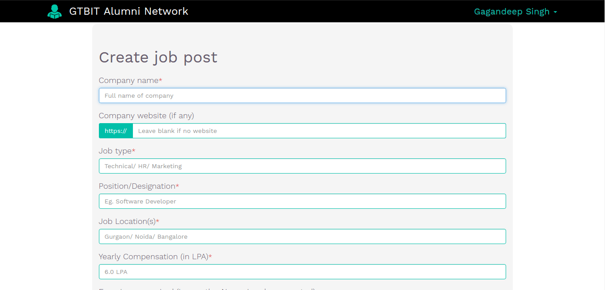

# GTBIT Alumni Network source code
This website was created to connect GTBIT alumni with current batches as there was no formal platform used by all / encouraged by college. The main motive was to make sure that students are able to clear all career related queries by asking questions. An option was added to ask 'anonymously' so that students are not shy to ask anything (I've seen this as a major problem in college students).

# Features
This was not a very rocket science thing and had simple very options

1. Anybody was allowed to ask a question and add tags to the question to clear the scope. Identity could be the person himself/herself or anonymous.

2. Anybody was allowed to post a job using a simple interface which asked basic things like Name of company, designation, CTC, location, etc. A job post was created using this information. Identity of the person was always visible for a job post.

3. An option was added specially for experienced people so that they can share their experience about a job or probably a post graduation school. Here also, an option was present to post anonymously.

4. Other features include :
  * Admin panel for admins of the website to view actual identity of people who post anonymous questions and other stats related to
website.
  * Search / View other users, questions, experience posts, job posts, etc (everything paginated).
  * Meta tags were added to almost all pages so that posts are rendered nicely on blogs / social networking platforms if anybody is sharing things there.
  * Nicely designed profile page and options to add basic information about yourself, college batch, job details, etc.
  * Option to browse site without logging in (read-only mode) for non-GTBIT students (as the website allowed only GTBITians to log in).
  * Notification page to notify incase somebody replied to a post added by you or on which you added a comment. In case a notification remains unseen for more than a day, a mail was sent to the user.

# Tech Stack
* Backend - Ruby on rails (4.2.5.1), Ruby (2.3.0)
* Databases - Mysql (5.5), Redis (3.2)
* Frontend - Embedded Ruby, SASS, Jquery (basic AJAX), Bootstrap (v3.0)
* Proxy server - Nginx (1.11.0)
* App server - Phusion Passenger (5.0.3.0)
* Server Operating System - Ubuntu (14.04 LTS)

# Setting it up locally
The guide assumes that you are keep source code inside 'gan' user on an Ubuntu 14 server (For newer versions, few things may vary).

1. If you are not interested to create 'gan' user, create a directory named 'gan' inside home directory of your user and create a symlink like this

        cd ~
        mkdir gan
        ln -s gan /home/gan

2. Install required packages

        sudo apt-get update
        sudo apt-get -y install ruby-dev
        sudo apt-get -y install libcurl3 libcurl3-dev libgmp3-dev
        sudo apt-get -y install mysql-server-5.5
        sudo apt-get -y install build-essential libssl-dev libcurl4-gnutls-dev libexpat1-dev gettext unzip
        sudo apt-get -y install git
        sudo apt-get -y install tcl8.5
        sudo apt-get -y install curl
        sudo apt-get -y install libmysqlclient-dev
        sudo apt-get -y install nodejs

        # Redis installation from source
        wget http://download.redis.io/releases/redis-stable.tar.gz
        tar xzf redis-stable.tar.gz
        cd redis-stable
        make
        make test
        sudo make install

        # Imagemagick. If install is not working, install from source
        sudo apt-get -y install imagemagick

3. Config git user (in case you are not having git configured on your machine)

        git config --global user.name "Your name"
        git config --global user.email "Your email"

4. Install RVM, Ruby

        pg --keyserver hkp://keys.gnupg.net --recv-keys 409B6B1796C275462A1703113804BB82D39DC0E3

        # If above command hangs at ‘importing keys’ run the command below otherwise don’t run. Both of them do the same task in different ways

        curl -sSL https://rvm.io/mpapis.asc | gpg --import  -
        \curl -sSL https://get.rvm.io | bash -s stable

        # LOGOUT SSH SHELL AND LOGIN AGAIN
        rvm reload
        rvm install 2.3.0

5. Clone source code, install gems, create tables and demo users

        git clone git@github.com:gagan93jtg/gtbit_alumni.git
        rvm use 2.3.0@global
        gem install bundler
        cd /home/gan/gtbit_alumni
        bundle install

        # At this point, edit config/config.yml if redis running on a different port and
        # config/database.yml for database credentials

        RAILS_ENV=development bundle exec rake db:drop db:create db:migrate db:seed

6. For running locally, you don't need nginx based setup so default app server is fine. Start redis and rails server.

        sudo start redis_daemon
        cd ~/gan/gpf; rails s
        Fire up localhost:3000 in your browser.

# Screenshots

Login page

  
After logging in, you see your and other people's posts

  
Notifications page

  
Post a new job

  
Post a question

  
Post detail, comments

  
User profile page

  
List of other users by joining date

  
